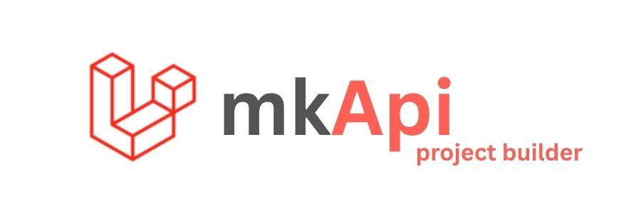

# MkApi

[](https://github.com/mk990/MkApi)

[](https://github.com/mk990/MkApi/blob/main/LICENSE)

---



# 🚀 API Development with Laravel MkApi

**MkApi** is a Laravel-based CLI tool that simplifies API development by generating essential files like models, controllers, and Swagger documentation — all with a single command. It’s designed to help you build faster, cleaner, and more documented APIs. 🧰✨

---

## 📦 Packages Used

This project utilizes the following packages to boost development and maintain high standards:

| 📦 Package Name              | 📝 Description                                                                           | 🔢 Version |
| ---------------------------- | ---------------------------------------------------------------------------------------- | ---------- |
| `l5-swagger`                 | Swagger API documentation generator for Laravel.                                         | ^8.6       |
| `jwt-auth`                   | JSON Web Token (JWT) authentication for secure APIs.                                     | ^2.7       |
| `larastan`                   | Static analysis tool to catch bugs early using PHPStan for Laravel.                      | ^3.0       |
| `laravel-backup`             | Seamless backup of databases and files in Laravel apps.                                  | ^9.1       |
| `laravel-pulse`              | Real-time performance insights for Laravel applications.                                 | ^1.4       |
| `laravel-telescope`          | Debugging assistant for Laravel. Monitors requests, logs, queries, mail, jobs, and more. | ^5.8       |
| `laravel-persian-validation` | Persian-specific validation rules for form requests.                                     | ^2.0       |
| `verta`                      | Date handling between Solar and Gregorian calendars.                                     | ^8.5       |
| `turnstile`                  | Easy integration with Cloudflare Turnstile for bot protection.                           | ^2.0       |

---

## ⚙️ Installation

### 📥 Install MkApi Tool

```bash
composer require mk990/mkapi --dev
php artisan install:mkapi
```

🔧 The following packages are installed by default:

- `l5-swagger`
- `jwt-auth`
- `larastan`

---

### 🎛️ Install Optional Packages

Use the interactive install command to choose additional tools:

```bash
php artisan install:mkapi --package
```

📌 Available packages:

- `laravel-backup`
- `laravel-pulse`
- `laravel-telescope`
- `laravel-persian-validation`
- `verta`
- `turnstile`

---

## 🛠️ Usage

MkApi provides easy-to-use artisan commands to generate models and controllers with Swagger support.

### 🧱 Generate a Model

```bash
php artisan mkapi:Model YOUR_MODEL_NAME
```

✅ Examples:

```bash
php artisan mkapi:Model product
php artisan mkapi:Model all
```

---

### 🎮 Generate a Controller

```bash
php artisan mkapi:Controller YOUR_CONTROLLER_NAME
```

✅ Examples:

```bash
php artisan mkapi:Controller product
php artisan mkapi:Controller all
```

---

## 🧩 Command Options

### 🔁 `--force`: Overwrite Existing Files

```bash
php artisan mkapi:Model product --force
```

This will replace any existing `ProductModel.php` file.

---

### 🧾 `--code`: Add Swagger Documentation & Controller Logic

```bash
php artisan mkapi:Controller product --code
```

🧠 Example generated method in `ProductController.php`:

```php
public function store(Request $request): JsonResponse
{
    $validated = $request->validate([
        'name' => 'required|string|max:255',
    ]);

    try {
        return $this->success(Product::create($validated));
    } catch (Exception $e) {
        Log::error($e->getMessage());
        return $this->error('create error');
    }
}
```

➡️ Explore more generated methods in the [TestController](https://github.com/Emadshirzad/mkapi/blob/master/src/TestController.php) file.

---

## 🤝 Contributing

We love contributions! If you have ideas or improvements, feel free to:

- 📌 [Create an Issue](https://github.com/mk990/MkApi/issues)
- 🚀 [Submit a Pull Request](https://github.com/mk990/MkApi/pulls)

---

## 📝 License

This project is licensed under the [MIT License](https://opensource.org/licenses/MIT).

---

## 👥 Contributors

- 👨‍💻 [mk990](https://github.com/mk990)
- 👨‍💻 [Emad Shirzad](https://github.com/Emadshirzad)

---
